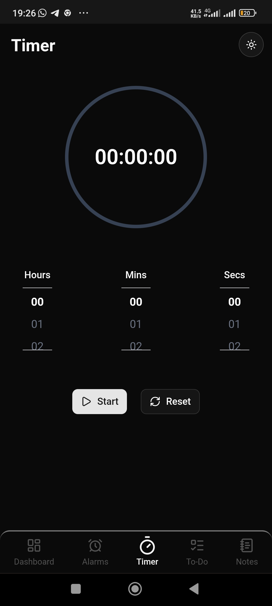

# Blend • Multitasking made easy

<div style="display: flex; align-items: center; justify-content: center;">
  
</div>

> A minimalist productivity app that keeps your notes, tasks, and timers in one place.


Blend is a sleek, client-side productivity application designed to streamline your daily tasks. It combines essential tools like notes, alarms, a timer, and a to-do list into a single, intuitive interface. Built with Next.js and TypeScript, it offers a seamless and responsive experience on both desktop and mobile devices.

---

## Mobile Screenshot

<div style="display: flex; align-items: center; justify-content: center;">
  
</div>

---

## Features

- **Dashboard**: A central hub featuring an elegant analog or digital clock and a summary of your recent activities.
- **Notes**: A fully-featured note-taking module. Create, edit, and manage your thoughts with an auto-saving editor.
- **Alarms**: Set and manage multiple alarms. Get timely notifications with sound alerts to stay on schedule.
- **Timer**: A versatile countdown timer with a circular progress indicator. Perfect for focused work sessions or tracking activities.
- **Todo List**: Keep track of your tasks with a simple and effective to-do list manager.
- **Responsive Design**: A fluid user experience that adapts perfectly from large desktop screens to mobile devices.
- **Light & Dark Modes**: Switch between themes to suit your preference and reduce eye strain.
- **Local Persistence**: All your data is securely saved in your browser's local storage, ensuring privacy and quick access.

## Technologies Used

| Technology       | Description                                      |
| ---------------- | ------------------------------------------------ |
| **Next.js**      | A React framework for building user interfaces.  |
| **React**        | A JavaScript library for building UIs.           |
| **TypeScript**   | Static typing for robust and scalable code.      |
| **Tailwind CSS** | A utility-first CSS framework for rapid styling. |
| **shadcn/ui**    | Re-usable components for building UIs.           |
| **Lucide React** | A comprehensive icon library.                    |
| **Howler.js**    | An audio library for handling alarm sounds.      |
| **Vercel**       | Used for analytics and deployment.               |

## Getting Started

Follow these instructions to set up the project on your local machine.

### Installation

1.  **Clone the repository**

    ```bash
    git clone https://github.com/Spectra010s/blend.git
    ```

2.  **Navigate to the project directory**

    ```bash
    cd blend
    ```

3.  **Install the dependencies**

    ```bash
    npm install
    ```

4.  **Run the development server**
    ```bash
    npm run dev
    ```
    The application will be available at `http://localhost:3000`.

## Usage

Once the application is running, you can explore its various features:

- **Navigation**: On desktop, use the expandable sidebar on the left to switch between the Dashboard, Timer, Notes, Alarms, and Todo sections. On mobile, use the bottom navigation bar.
- **Creating Content**: In the Notes, Alarms, or Todo sections, look for the `+` button (on mobile) or an "Add" button to create new entries.
- **Editing & Deleting**:
  - **Notes**: Click on a note card to open the editor. To delete, press and hold the note card until the delete icon appears.
  - **Alarms**: Click an alarm to edit its time. Press and hold to reveal the delete option.
- **Data Storage**: All your data is automatically saved to your browser's local storage. There is no need for a backend server or an account.

## Contributing

Contributions are what make the open-source community such an amazing place to learn, inspire, and create. Any contributions you make are **greatly appreciated**.

1.  **Fork the Project**
2.  **Create your Feature Branch** (`git checkout -b feature/AmazingFeature`)
3.  **Commit your Changes** (`git commit -m 'Add some AmazingFeature'`)
4.  **Push to the Branch** (`git push origin feature/AmazingFeature`)
5.  **Open a Pull Request**

Read more in [CONTRIBUTING](./CONTRIBUTING.md)

## License

This project is licensed under the MIT License. See the [LICENSE](./LICENSE) file for more details.

## Author

**Spectra**

- **GitHub**: [@Spectra010s](https://github.com/Spectra010s)
- **Twitter**: [@Spectra010s](https://x.com/Spectra010s)
- **LinkedIn**: [Adeloye Adetayo](https://www.linkedin.com/in/adeloye-adetayo-273723253)

---

[](https://www.npmjs.com/package/dokugen)
